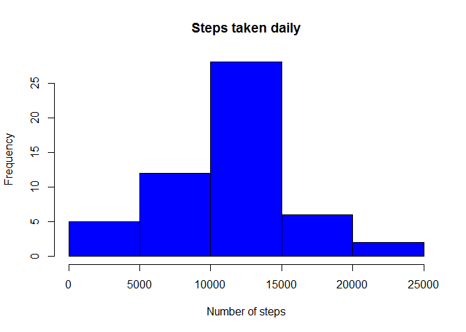
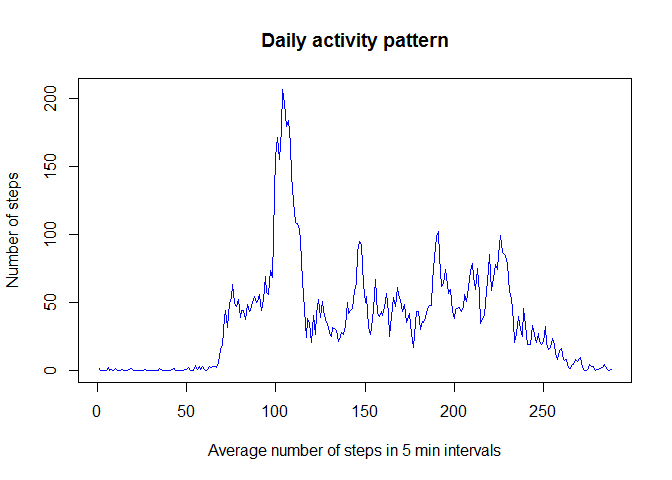
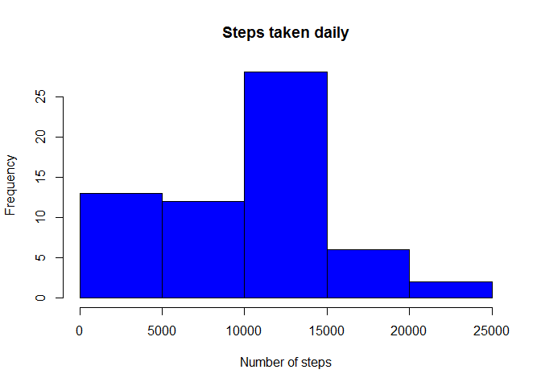

# Reproducible Research: Peer Assessment 1


## Loading and preprocessing the data


```r
zipFile <- "activity.zip"
unzip(zipFile)
uzFile <- unzip(zipFile, list = TRUE)
uzFileName <- uzFile[1]$Name
rawData <- read.csv(uzFileName)
```

## What is mean total number of steps taken per day?

```r
dailySteps <- aggregate(rawData[, 1], list(rawData$date), sum)
hist(dailySteps$x, main="Steps taken daily",xlab="Number of steps", col = "blue")
```



```r
(meanSteps <- mean(dailySteps[, 2], na.rm = TRUE))
```

```
## [1] 10766.19
```

```r
(medianSteps <- median(dailySteps[, 2], na.rm = TRUE))
```

```
## [1] 10765
```

## What is the average daily activity pattern?

```r
intervalSteps <- aggregate(rawData[, 1], list(rawData$interval), FUN = mean, na.rm = TRUE)
plot(intervalSteps$x, main = "Daily activity pattern", type = "l", 
     xlab = "Average number of steps in 5 min intervals",
     ylab = "Number of steps", col = "blue")
```



```r
(which.max(intervalSteps$x))
```

```
## [1] 104
```


## Imputing missing values

```r
(totalNAs <- sum(is.na(rawData$steps)))
```

```
## [1] 2304
```

```r
len <- nrow(rawData)
newData <- rawData

for (i in 1:len) {
    ## We only have to modify if NA
    if (is.na(newData$steps[i])) {
        if (i == 1 || i == len) newData$steps[i] <- 0 
        else {
            newData$steps[i] <- sum(newData$steps[i - 1], newData$steps[i + 1], na.rm = TRUE) / 2
        }
    }
    
}

dailySteps <- aggregate(newData[, 1], list(newData$date), sum)
hist(dailySteps$x, main="Steps taken daily",xlab="Number of steps", col = "blue")
```



```r
(meanSteps <- mean(dailySteps[, 2], na.rm = TRUE))
```

```
## [1] 9354.23
```

```r
(medianSteps <- median(dailySteps[, 2], na.rm = TRUE))
```

```
## [1] 10395
```
The strategy I used was to use the mean of the two adjacent intervals. It is not the optimal strategy, but would work well for single NA values. But if an entire day is missing it will use zeros for that day, that's why the histogram is different and the mean and median are smaller too.


## Are there differences in activity patterns between weekdays and weekends?

```r
newData$weekDayEnd <- ifelse((weekdays(as.Date(newData$date)) == 'Saturday' | weekdays(as.Date(newData$date)) == 'Sunday'), "weekend", "weekday")

## Plotting
par(mfrow = c(2, 1))
weekendInd <- newData$weekDayEnd == "weekend"
weekdayInd <- newData$weekDayEnd == "weekday"

weekendSteps <- aggregate(newData[weekendInd, 1], list(rawData$interval[weekendInd]), FUN = mean, na.rm = TRUE)
weekdaySteps <- aggregate(rawData[weekdayInd, 1], list(rawData$interval[weekdayInd]), FUN = mean, na.rm = TRUE)

plot(weekendSteps$x, main = "Weekend", type = "l", 
     xlab = "Intervals",
     ylab = "Number of steps", col = "blue")


plot(weekdaySteps$x, main = "Weekday", type = "l", 
     xlab = "Intervals",
     ylab = "Number of steps", col = "red")
```


There are some differences in the weekday/weekend patterns, on weekdays the peak is higher, but on weekends the drop is not so significant during the day.
